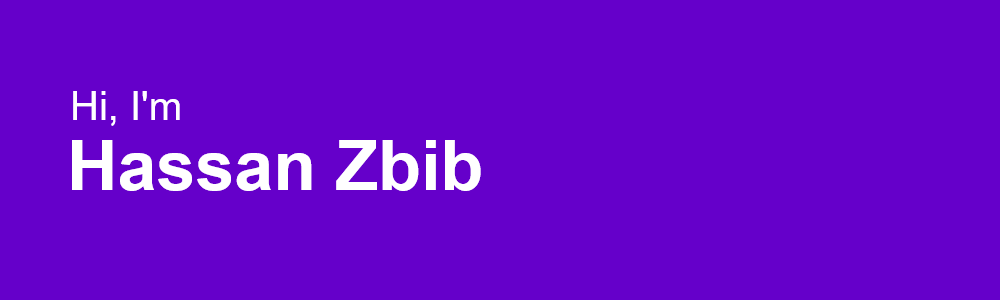

<!--
**Hassan-Zbib/Hassan-Zbib** is a ✨ _special_ ✨ repository because its `README.md` (this file) appears on your GitHub profile.
-->

 

I'm a passionate self-taught full stack web developer and a freelance software engineer from Lebanon. my passion for software lies with dreaming up ideas and making them come true with elegant interfaces. i take great care in the experience, architecture, and code quality of the things I build.

i am also an open-source enthusiast. i learned a lot from the open-source community and i love how collaboration and knowledge sharing happened through open-source.

---

<i>Contact me on:</i> 

📈 My GitHub Stats  

